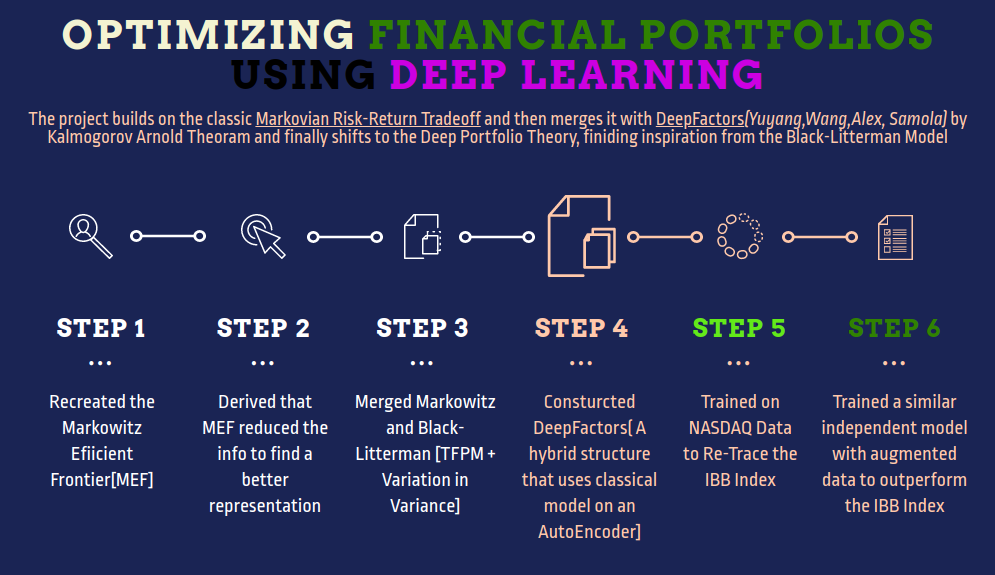
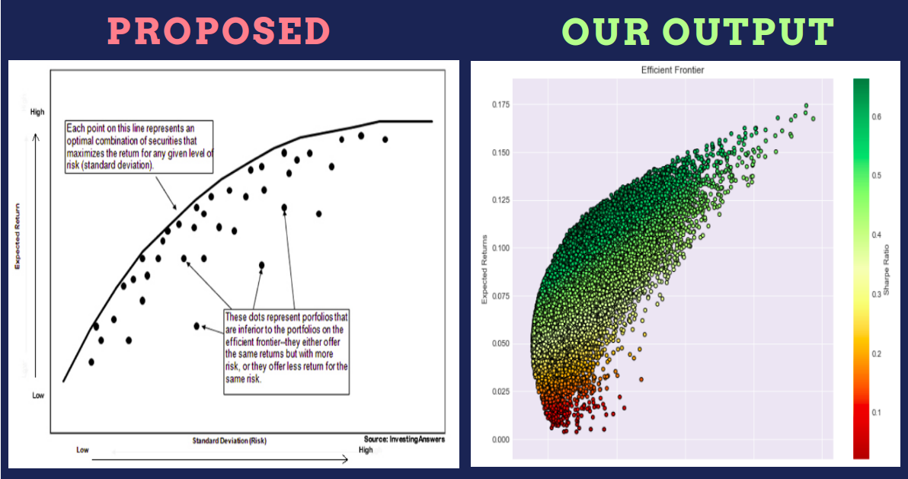
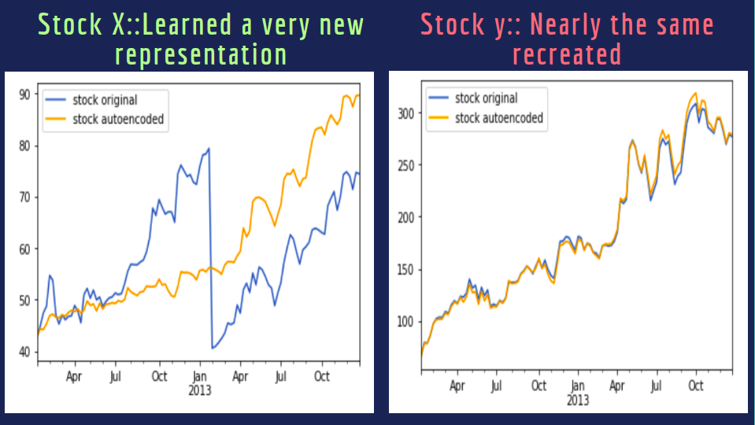
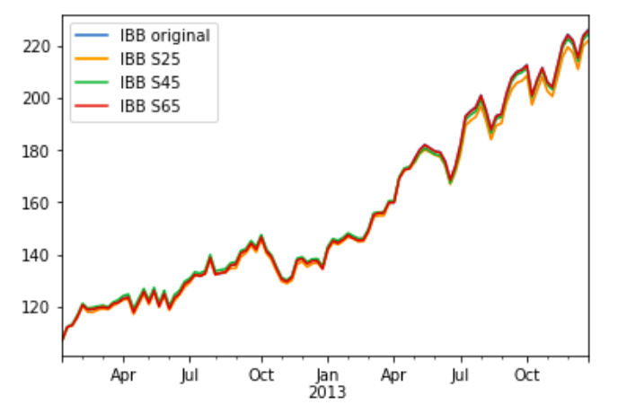
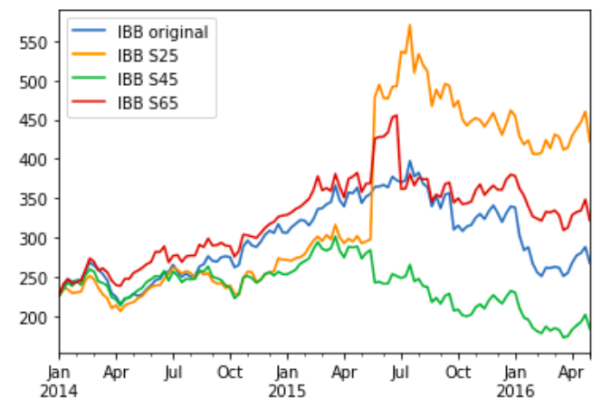
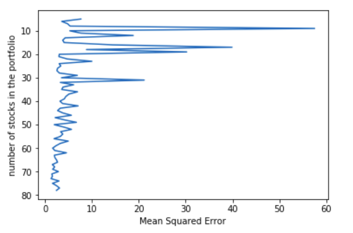

# Deep Financial Portfolios :: A Hybrid Structure

> Work of [**Tapasya Pratap Singh**](https://www.linkedin.com/in/tapasya-pratap-singh-565497153/) & [**Devang Upadhyay**](https://www.linkedin.com/in/devangupadhyay/) under the guidance of [**Prof. Abhijeet Chandra**](https://www.linkedin.com/in/abhijeetc/), when the former two were working as Research Assistants in the [**Vinod Gupta School of Management, IIT Kharagpur**](https://som.iitkgp.ac.in/)

## MPT :: Reconstructing the Markovian Efficient Frontier 

#### Modern Portfolio Theory has :
- The idea of **risk-averse** investors
- The idea to maximize profits and minimize risk

#### Here the following has been done to generate the Efficient Frontier
- 5 Securities of NASDAQ[*data from Quandl*] have been used in the portfolio
- Portfolio weights have been randomized and generated to give a total of **50,000 portfolios**
- Data is from 01-01-2014 to 32-12-2016 [Average of 250 Trading days/year]
- *Sharpe-Ratio* has been included as a measure of **Return/Risk**

## AutoEncoder :: Outputs
- The AutoEncoder works like a **black box** model and *learns a complex and better representation* of the market data
- The encoded data is difficult for us to comprehend. Some of the securities show a lot of variance with the original, while others, close to zero

## Re-Tracing the IBB Index :: 

## Outperforming the IBB Index ::

- In a seperate instance of the model used to re-trace the index, data was augmented in the caliberation phase to replace all the returns smaller than 5% by 5%, this ensures anti-correlation in the periods of large drawdowns
- It is clearly visible that the portfolios of 65 securtites outperform the original Index

## Unique Observation :: Spikes in the performance of varying portfolio size

## License

[MIT](https://choosealicense.com/licenses/mit/)